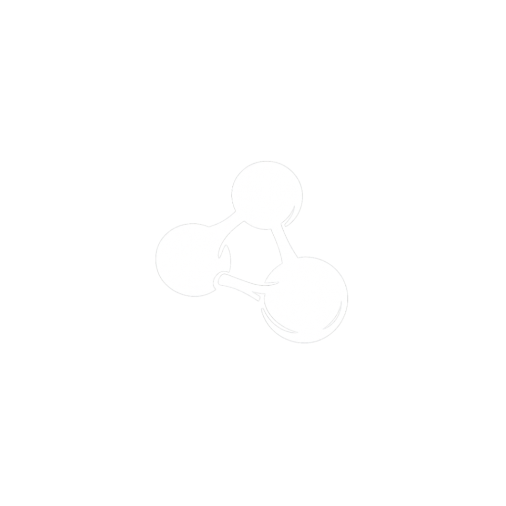
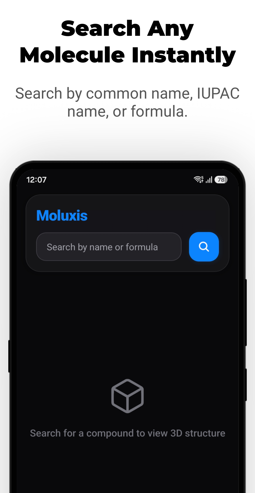
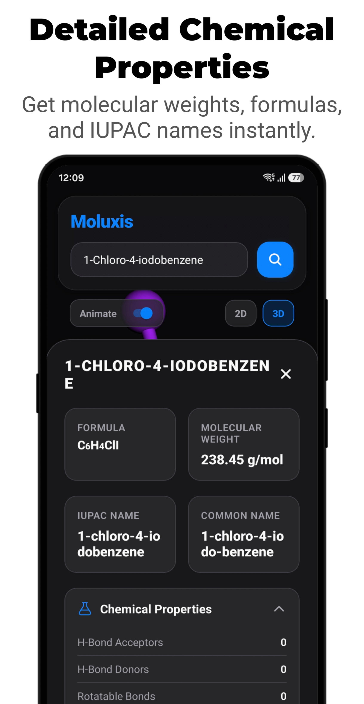
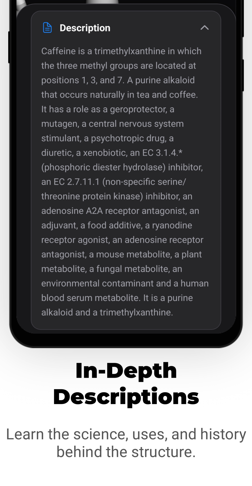
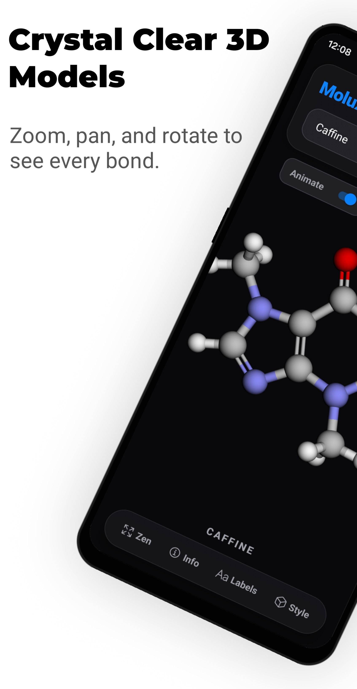
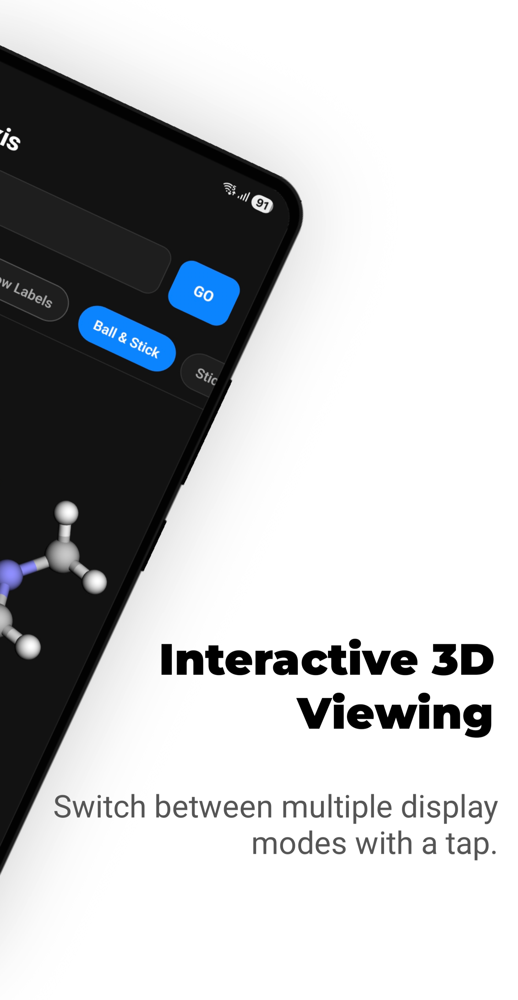

<div align="center">
  
  <h1>Moluxis</h1>
  <p>
    <b>A Modern 3D Molecule Explorer for Android</b>
  </p>
  <p>
    Search, visualize, and explore chemical compounds in interactive 3D.
  </p>
</div>


---

## 📖 Overview

**Moluxis** is a powerful Android application built with Expo that allows students, chemists, and enthusiasts to explore the molecular world. Powered by the **PubChem** database and the **Crystallography Open Database (COD)**, Moluxis provides real-time access to millions of chemical compounds, offering detailed chemical properties, safety data, and fully interactive 3D structures or crystal lattices directly on your mobile device.

The app features a sleek, dark-themed UI designed for focus and clarity.

## 📲 Installation

[](https://play.google.com/store/apps/details?id=com.ankushsarkar.moluxis)
[](https://github.com/ankrypht/Moluxis/releases/latest)

## 📱 Screenshots

<div align="center">
   
   
   
   
   
</div>

## ✨ Features

### 🔍 **Smart Search**

- **Instant Search:** Find compounds by common names (e.g., "Caffeine", "Aspirin") or IUPAC names.
- **Autocomplete:** Intelligent suggestions help you find the exact compound you're looking for as you type.

### 🧪 **Interactive 3D & 2D Visualization**

- **2D & 3D Structure Modes:** Seamlessly switch between flat 2D chemical diagrams and interactive 3D models.
- **High-Performance Rendering:** Powered by `3Dmol.js` within a customized WebView.
- **Multiple Visualization Modes:**
  - 🎾 **Ball & Stick:** Standard chemistry visualization.
  - 🥢 **Sticks:** Clean view emphasizing bond connectivity.
  - 🔴 **Space-Fill:** Realistic van der Waals volume representation.
  - 🕸️ **Wireframe:** Minimalist view for complex structures.
- **Auto-Rotation:** Toggle smooth 360° rotation to inspect molecules dynamically from every angle.
- **Zen Mode (Full Screen):** Enter an immersive, distraction-free view hiding all overlays and floating controls.
- **Responsive Landscape Mode:** Adaptive dual-pane orientation layout with floating dock and persistent compound name overlay.
- **Crystal Structures:** Visualizes 3D crystal lattices for inorganic compounds via COD integration.
- **Atom Labels:** Quick toggle to view or hide individual element labels.

### 📊 **Comprehensive Chemical Data**

- **Physical Properties:** Molecular Weight, Formula, Density, Boiling/Melting Points, Solubility.
- **Chemical Attributes:** H-Bond Donors/Acceptors, Rotatable Bonds, TPSA, LogP.
- **Identifiers:** IUPAC Names (Preferred & Traditional), Common Synonyms.
- **External Links:** Direct access to full PubChem records and Crystallography Open Database (COD) entries.

### ⚠️ **Safety & Hazards**

- **GHS Classification:** Displays standard GHS Signal Words (e.g., "Danger", "Warning").
- **Hazard Statements:** Clear list of specific hazard warnings and safety precautions.

## 🛠️ Tech Stack

- **Framework:** [React Native](https://reactnative.dev/) (0.86+) via [Expo](https://expo.dev/) (SDK 57)
- **Language:** TypeScript
- **3D Engine:** [3Dmol.js](https://3Dmol.csb.pitt.edu/) (embedded via `react-native-webview`)
- **Data Sources:**
  - [PubChem PUG REST API](https://pubchem.ncbi.nlm.nih.gov/docs/pug-rest)
  - [Crystallography Open Database (COD)](https://www.crystallography.net/)
- **Build & Optimization:** Android R8 code & resource shrinking (`expo-build-properties`) and Metro inline requires
- **Testing:** Jest, `@testing-library/react-native`
- **UI Components:** Custom modular components with responsive scaling

## 🤝 Contributing

### Pull requests are welcome

- If you want to **develop new functions** or **fix a bug**, fork the repository and send a pull request.

### Prerequisites

- Node.js (LTS recommended)
- npm or yarn
- Android physical device or Android Emulator

### Running On Your System

1. **Clone the repository:**

   ```bash
   git clone https://github.com/ankrypht/moluxis.git
   cd moluxis
   ```

2. **Install dependencies:**

   ```bash
   npm install
   ```

3. **Start the development server:**

   ```bash
   npm start
   ```

4. **Run on Device or Emulator:**
   - **Development Build (Recommended):** Run `npm run android` to build and launch on your connected device or emulator.
   - **Expo Go:** Press `s` in the terminal to switch to Expo Go if supported.

5. **Run Tests & Linter:**

   ```bash
   npm test       # Run Jest test suite
   npm run lint   # Run Expo linter
   ```

## 📄 License

Copyright © 2026 Ankush Sarkar

Licensed under the Apache License, Version 2.0.

## 🙏 Acknowledgments

- **PubChem:** For providing the extensive chemical database and API.
- **3Dmol.js:** For the excellent JavaScript-based molecular visualization library.
- **Crystallography Open Database (COD):** For providing the open-access collection of crystal structures.
