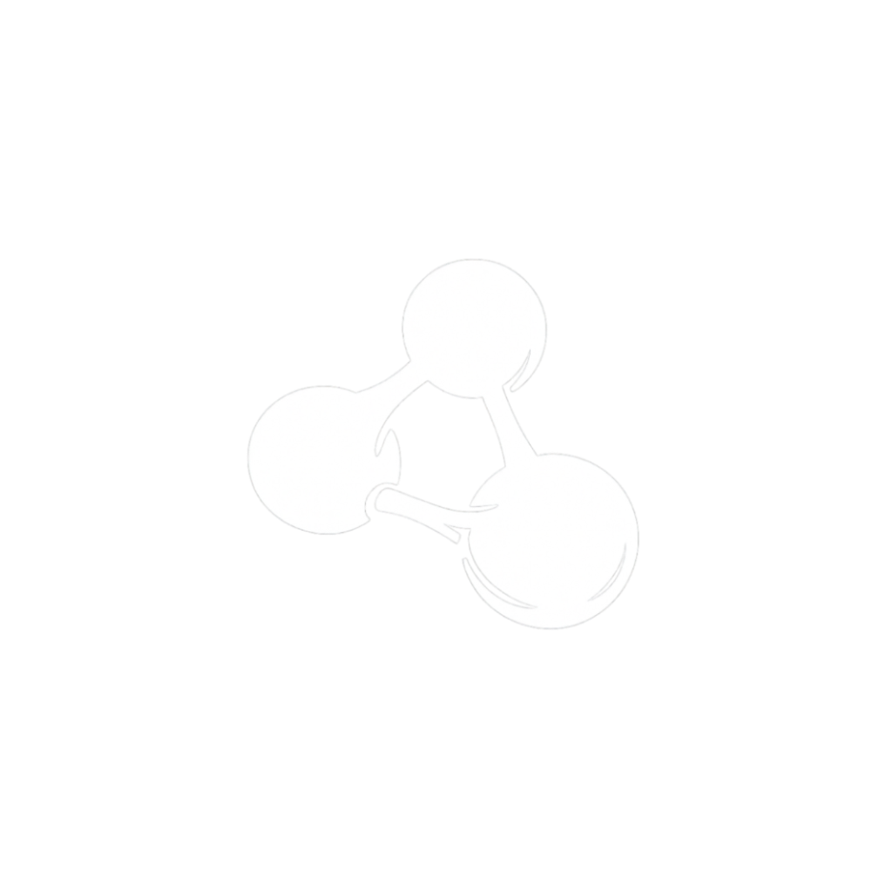

<div align="center">
  
  <h1>Moluxis</h1>
  <p>
    <b>A Modern, Fast 3D Molecule & Crystal Explorer for Android</b>
  </p>
  <p>
    Search, inspect, and visualize chemical compounds and mineral crystal lattices in interactive 3D and 2D.
  </p>

  <p>
    <a href="https://github.com/ankrypht/Moluxis/releases/latest"></a>
    <a href="LICENSE"></a>
    <a href="https://play.google.com/store/apps/details?id=com.ankushsarkar.moluxis"></a>
    <a href="https://expo.dev"></a>
    <a href="https://reactnative.dev"></a>
    <a href="https://www.typescriptlang.org/"></a>
  </p>

  <p>
    <a href="https://play.google.com/store/apps/details?id=com.ankushsarkar.moluxis">
      
    </a>
    &nbsp;&nbsp;
    <a href="https://github.com/ankrypht/Moluxis/releases/latest">
      
    </a>
  </p>

  <a href="https://play.google.com/store/apps/details?id=com.ankushsarkar.moluxis">
    
  </a>
</div>

---

## 📖 Overview

**Moluxis** is an open-source Android application for exploring chemical compounds and crystal structures in interactive 3D and 2D. Powered by the **PubChem** database and the **Crystallography Open Database (COD)**, Moluxis provides instant access to millions of molecular structures, physical and chemical properties, safety hazards, and crystal geometry — all wrapped in a sleek, dark-themed native interface.

---

## 📱 Screenshots

<div align="center">
  
  
  
  <br />
  
  
</div>

---

## ✨ Features

- **🧪 Interactive 3D & 2D Visualization**
  - **Multiple Render Styles:** Switch between Ball & Stick, Sticks, Space-Fill (VDW), and Wireframe.
  - **Viewer Controls:** 360° auto-rotation, element atom labels, and a distraction-free Zen (full-screen) mode.
  - **Dual Representation:** Seamlessly toggle between 3D molecular models and 2D chemical structural diagrams.
  - **Adaptive Layout:** Responsive split-screen view optimized for landscape orientation and tablets.

- **💎 Crystal Lattices & Minerals**
  - Visualize 3D unit cells and crystal lattice geometries for inorganic minerals via COD.

- **🌟 Curated Showcase & Category Tabs**
  - Discover iconic molecules across **Biochemicals**, **Medicinal**, and **Crystals & Minerals** with persistent tab filters.
  - Zero-latency startup with pre-bundled datasets loading instantly offline (0ms).

- **🔍 Smart Search & Chemical Typography**
  - Instant search across millions of compounds with real-time suggestions as you type.
  - Rich subscript formula formatting ($C_8H_{10}N_4O_2$, $H_2O$) across search results, cards, and property sheets.

- **📊 Deep Molecular & Safety Intelligence**
  - **Quick Stats:** Instant formula, molecular weight, IUPAC name, and common names.
  - **Expandable Drawers:** Collapsible sections for chemical properties (LogP, TPSA, H-bonds), physical constants (melting/boiling points, density, solubility), and synonyms.
  - **Safety & Hazards:** Standard GHS classifications, signal words, and hazard statements.
  - **Verified Citations:** Direct links to official PubChem and COD source records.

- **📤 High-Res Snapshot Export & Sharing**
  - **3D Canvas Snapshots:** Capture high-resolution PNG images of the 3D model at any angle or zoom level.
  - **Rich Share Sheets:** One-tap sharing of compound summaries, chemical formulas, and direct PubChem links.

- **⏱️ Recent History & Pinned Bookmarks**
  - "Jump Back In" quick-access carousel on launch to instantly revisit recent molecules.
  - One-tap bookmarking to save favorite compounds with protected persistent offline storage.

- **📳 Tactile Sensory & Themed Design**
  - Context-aware haptic feedback across style changes, Zen mode toggles, bookmarking, and search selections.
  - Custom dark-themed glassmorphic alert popups replacing generic system alerts.
  - Edge-to-edge Android layout with transparent system navigation bar integration.

- **⚡ Engineered for Speed & Stability**
  - **Smooth 60 FPS WebGL Loop:** Throttled requestAnimationFrame engine with automatic WebGL activity pausing during text input or modal inspection to eliminate ANRs and save battery.
  - **Multi-Tier Caching:** High-speed in-memory LRU cache backed by persistent disk storage.
  - **Smart Rate Limiting:** PubChem request queue with concurrency pacing and an automatic circuit breaker against server throttling.

---

## 🛠️ Tech Stack

| Layer                 | Technologies                                                                                                                                    |
| :-------------------- | :---------------------------------------------------------------------------------------------------------------------------------------------- |
| **Mobile Core**       | [React Native](https://reactnative.dev/) (0.86), [Expo](https://expo.dev/) (SDK 57), [TypeScript](https://www.typescriptlang.org/)              |
| **3D Engine**         | [3Dmol.js](https://3Dmol.csb.pitt.edu/) via `react-native-webview`                                                                              |
| **Data Sources**      | [PubChem PUG REST API](https://pubchem.ncbi.nlm.nih.gov/docs/pug-rest), [Crystallography Open Database (COD)](https://www.crystallography.net/) |
| **Storage & Caching** | AsyncStorage, FileSystem, Multi-tier LRU Memory & Disk Cache                                                                                    |
| **Sensory & Haptics** | [Expo Haptics](https://docs.expo.dev/versions/latest/sdk/haptics/)                                                                              |
| **Export & Sharing**  | [Expo Sharing](https://docs.expo.dev/versions/latest/sdk/sharing/), [Expo FileSystem](https://docs.expo.dev/versions/latest/sdk/filesystem/)    |
| **UI & Systems**      | Expo Navigation Bar, Expo System UI, Custom Glassmorphic Modal Alerts                                                                           |
| **Testing & Quality** | Jest, `@testing-library/react-native`, ESLint, Prettier                                                                                         |

---

## 🚀 Getting Started

### Prerequisites

- [Node.js](https://nodejs.org/) (LTS recommended)
- Android physical device or Android Emulator

### Development Setup

1. **Clone the repository:**

   ```bash
   git clone https://github.com/ankrypht/Moluxis.git
   cd Moluxis
   ```

2. **Install dependencies:**

   ```bash
   npm install
   ```

3. **Start the development server:**

   ```bash
   npm start
   ```

4. **Run on Android:**

   ```bash
   npm run android
   ```

5. **Run tests & linter:**
   ```bash
   npm test
   npm run lint
   ```

---

## 📄 License

Distributed under the **Apache License 2.0**. See [`LICENSE`](LICENSE) for details.

---

## 🙏 Acknowledgments

- **[PubChem](https://pubchem.ncbi.nlm.nih.gov/)** — Comprehensive open chemical database and API.
- **[3Dmol.js](https://3Dmol.csb.pitt.edu/)** — High-performance WebGL molecular visualization library.
- **[Crystallography Open Database (COD)](https://www.crystallography.net/)** — Open-access collection of crystal structures.
