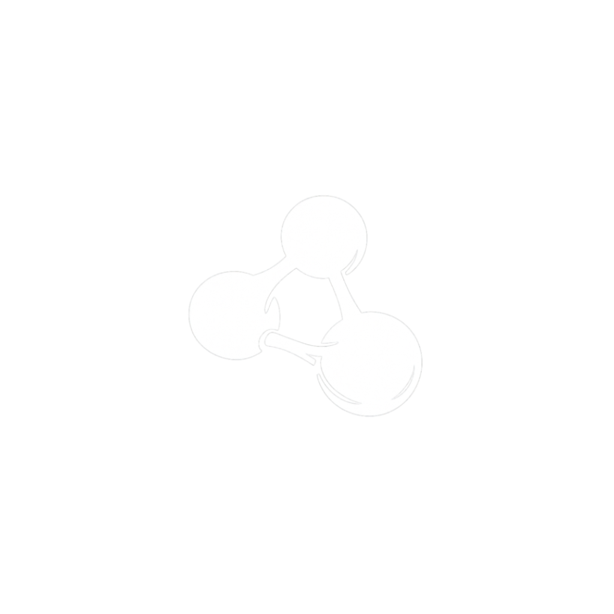
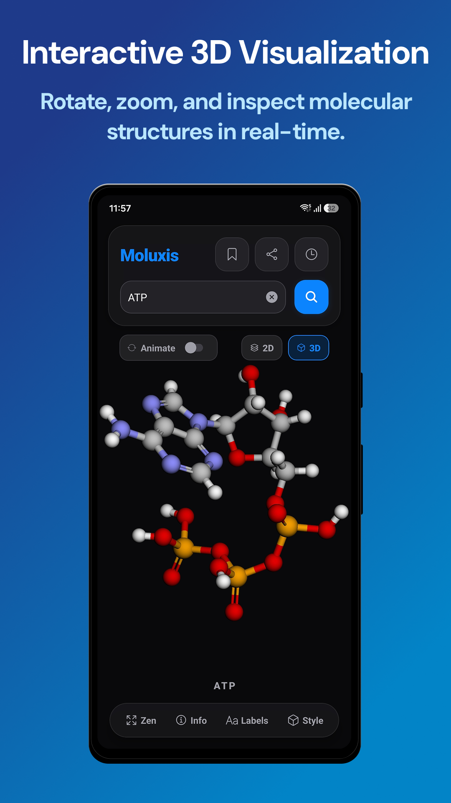
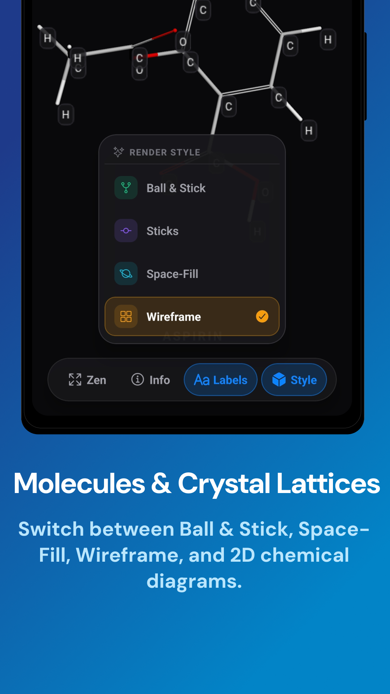
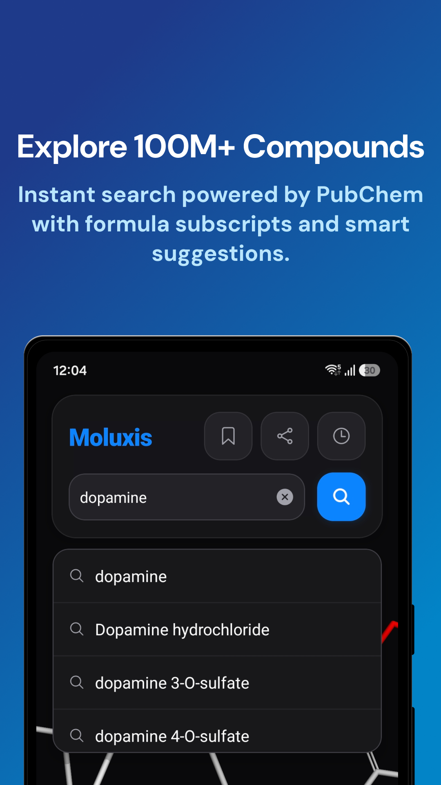
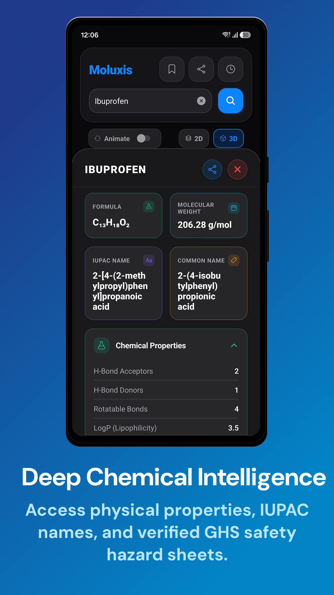
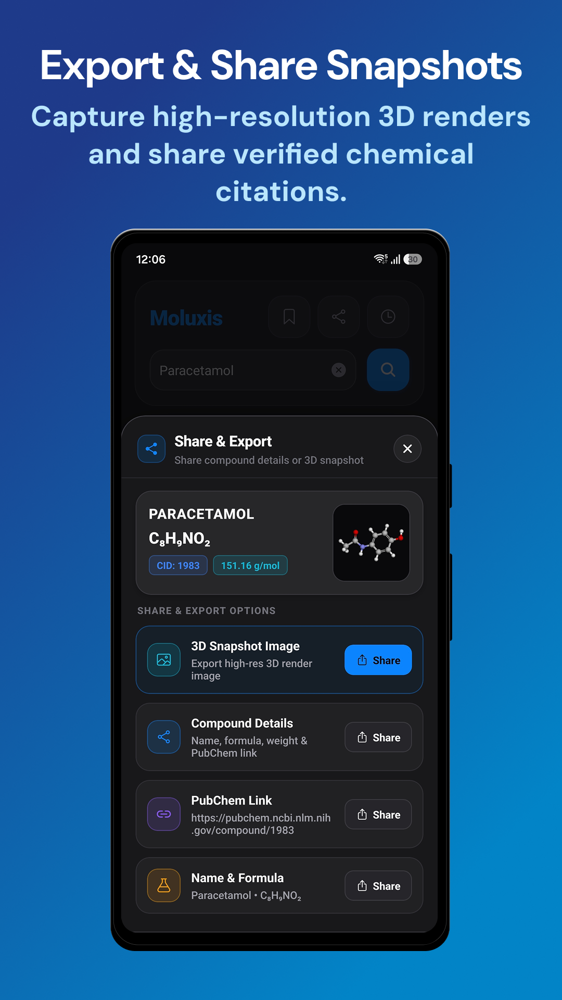

<div align="center">
  
  <h1>Moluxis</h1>
  <p>
    <b>A Modern 3D Molecule Explorer for Android</b>
  </p>
  <p>
    Search, visualize, and explore chemical compounds in interactive 3D.
  </p>


</div>

---

## 📖 Overview

**Moluxis** is an open-source Android application for exploring chemical compounds and crystal lattices in interactive 3D and 2D. Powered by the **PubChem** database and the **Crystallography Open Database (COD)**, Moluxis provides real-time access to millions of chemical structures, physical properties, and safety data.

## 📲 Installation

[](https://play.google.com/store/apps/details?id=com.ankushsarkar.moluxis)
[](https://github.com/ankrypht/Moluxis/releases/latest)

## 📱 Screenshots

<div align="center">
   
   
   
   
   
</div>

## ✨ Features

### 🧪 Interactive 3D & 2D Visualization

- **Dual View Modes:** Seamlessly switch between interactive 3D models and 2D chemical diagrams.
- **Render Styles:** Ball & Stick, Sticks, Space-Fill, and Wireframe.
- **Crystal Lattices:** Visualize 3D crystal structures for inorganic minerals via COD.
- **Viewer Controls:** 360° auto-rotation, atom labels, and Zen (full-screen) mode.
- **Adaptive Layout:** Responsive split-screen view in landscape orientation.

### 🔍 Smart Search & Autocomplete

- **Instant Search:** Find compounds by common name or IUPAC nomenclature.
- **Live Suggestions:** Intelligent suggestions as you type.

### 🌟 Curated Molecule Showcase

- **Home Exploration:** Discover iconic molecules across Biochemicals, Medicinal, and Crystals & Minerals.
- **Instant Offline Showcase:** Pre-bundled datasets for all featured molecules load instantly (0ms) with zero network requests.
- **One-Tap 3D View:** Tap any card to immediately load and inspect spinning 3D structures.

### ⏱️ Recent Searches & Bookmarks

- **Jump Back In:** Quick-access carousel on the home screen to revisit recent searches and favorites.
- **Multi-Tier Offline Cache:** High-speed RAM cache backed by persistent disk storage with LRU eviction and pinned bookmark protection.
- **One-Tap Bookmarking:** Save active compounds directly from the viewer header.

### 🛡️ High Reliability & Smart Networking

- **Adaptive Rate Limiting:** Request queue with dynamic pacing and concurrency control respecting PubChem's `X-Throttling-Control` headers.
- **Circuit Breaker:** Automatic cooldown trip and queue draining on server throttling (429/503) to protect client IP addresses.
- **Optimized Data Pipeline:** Staged waterfall queries bypass redundant structure views, and in-flight searches cancel cleanly via `AbortController`.

### 📊 Chemical Data & Safety

- **Properties & Attributes:** Molecular weight, formula, density, melting/boiling points, solubility, hydrogen bonds, LogP, and TPSA.
- **Safety Data:** Standard GHS classifications, signal words, and hazard statements.
- **External References:** Direct links to PubChem and COD source records.

## 🛠️ Tech Stack

- **Framework:** [React Native](https://reactnative.dev/) via [Expo](https://expo.dev/) (SDK 57)
- **Language:** TypeScript
- **3D Engine:** [3Dmol.js](https://3Dmol.csb.pitt.edu/) embedded via `react-native-webview`
- **Data & Storage:** [PubChem PUG REST API](https://pubchem.ncbi.nlm.nih.gov/docs/pug-rest), [Crystallography Open Database (COD)](https://www.crystallography.net/), and [AsyncStorage](https://react-native-async-storage.github.io/async-storage/)
- **Architecture:** Multi-tier caching (RAM + Disk), rate-limiting request queue, and circuit breaker resilience
- **Testing:** Jest & `@testing-library/react-native`

## 🤝 Contributing

Contributions are welcome! Feel free to open an issue or submit a pull request.

### Prerequisites

- Node.js (LTS recommended)
- npm or yarn
- Android physical device or Android Emulator

### Development Setup

1. **Clone the repository:**

   ```bash
   git clone https://github.com/ankrypht/moluxis.git
   cd moluxis
   ```

2. **Install dependencies:**

   ```bash
   npm install
   ```

3. **Start the development server:**

   ```bash
   npm start
   ```

4. **Run on Android:**
   - **Development Build:** Run `npm run android` to build and launch on your connected device or emulator.
   - **Expo Go:** Press `s` in the terminal to switch to Expo Go if supported.

5. **Run tests & linter:**

   ```bash
   npm test
   npm run lint
   ```

## 📄 License

Copyright © 2026 Ankush Sarkar

Licensed under the Apache License, Version 2.0.

## 🙏 Acknowledgments

- **PubChem:** Comprehensive chemical database and API.
- **3Dmol.js:** High-performance molecular visualization library.
- **Crystallography Open Database (COD):** Open-access collection of crystal structures.
